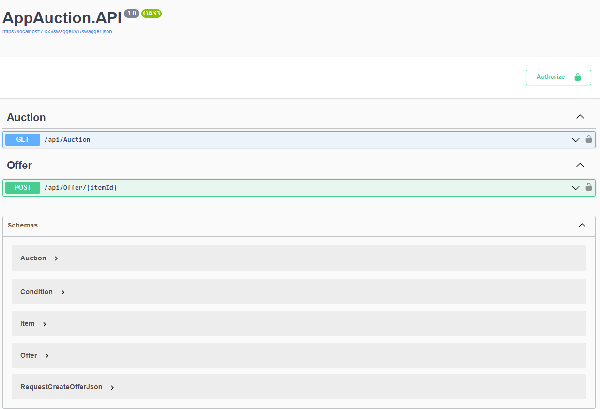

# APi rest de um leilão

Criação de uma Api de leilão que mostra os leilões criados e com uma requisição htpp com metodo GET uma requisição que cria as ofertas pelos itens do leilão com requisição http com o metodo POST . nessa api cria uma implementação fake de uma autenticação e autorização

## Documentação da Api

Imagem do Swagger

### Stack Utilizada

* Dotnet 8
* EntityFrameworkCore
* Sqlite
* Swagger
* Xunit
* Bogus
* Moq
* FluentAssertions
